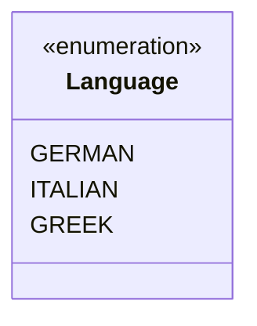

# Перечисления языков

Некий справочник, в котором содержатся доступные для всей системы языки.

На данном этапе необходимо наличие трёх языков: Немецкий, Итальянский, Греческий

```mermaid
classDiagram
    class Language {
        <<enumeration>>
        GERMAN
        ITALIAN
        GREEK
    }
```