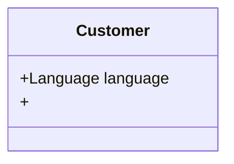

# Покупатель

## Языком метафор в рамках текущего задания

В данном случае покупателем можно представить собеседником телефонного разговора.

У него есть определённый язык (Немецкий, Греческий, Итальянский). Либо он не определён и мы не сможем с ним говорить.

У него есть определённый вопрос по поводу определённой финальной стоимости товара определённой валюты (EUR) для
определённой страны (Германия, Греция, Италия). Если что-то будет не определено, мы не сможем посчитать ему финальную
стоимость.

## Диаграмма класса

